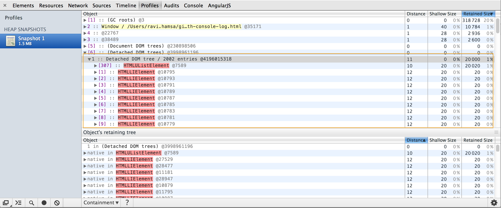

console.log is a easy way to debug web application, make sure you have some build procedure to clear it out before deploying, else it can lead to serious memory leaks, heap snapshot from page with console.log reveals that it maintain reference in memory even after clearing. 

